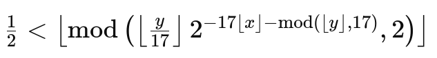

# Tupper's Formula Visualizer

## Overview

Tupper's self-referential formula is a mathematical formula that visually represents itself when graphed at a specific location in the (x, y) coordinate plane. It was created by Jeff Tupper and is a type of "self-replicating" image derived from a single algebraic equation.

The formula is defined as:

<!--\[ \frac{1}{2} < \left\lfloor \text{mod} \left( \left\lfloor \frac{y}{17} \right\rfloor 2^{-17 \lfloor x \rfloor - \text{mod} (\lfloor y \rfloor, 17)}, 2 \right) \right\rfloor \]-->
<!---->

This formula plots points in a range of 17 units wide and infinitely tall, where each coordinate point (x, y) can either be part of a graph or not, based on the binary outcome of the formula.

## Using the Web App

### Requirements

Before using the Tupper's Formula Visualizer, ensure your system meets the following requirements:
- A modern web browser (e.g., Chrome, Firefox, Safari, or Edge)
- JavaScript must be enabled in the browser

### Features

- **Input Options**: Users can input either text or an image. The app converts this input into a visual representation using Tupper's formula.
- **Visualization**: The web app displays the formula's graphical output on the screen.
- **LaTeX Export**: Users can generate and download LaTeX source code to compile a detailed document including the visual output and its corresponding formula.

### How to Use

1. **Open the Web App**: Start by navigating to the hosted URL where the Tupper's Formula Visualizer is available.

2. **Choose Input Type**:
    - **Text**: Select the "Text" radio button and enter up to 12 characters in the input field.
    - **Image**: Select the "Image" radio button and upload an image file using the Browse button.

3. **Generate Visualization**:
    - Click the "Convert and Display" button to see the graphical representation of the input based on Tupper's formula directly in the web browser.

4. **Export LaTeX Code**:
    - To generate a LaTeX document of the visualization, click the "Generate LaTeX" button. This will open a new window or tab displaying the LaTeX source code.
    - Copy and paste this code into a LaTeX editor to compile and view it as a PDF document.

### Note

The visual output depends significantly on the nature of the input and the precise calculations of Tupper's formula. Text inputs are transformed into a corresponding binary image before being processed by the formula.

## The App is here

The Tupper's Formula Visualizer offers an intriguing glimpse into the world of mathematical visualization, demonstrating the power of a simple algebraic formula to represent complex graphical data. Explore different inputs to discover the versatility of Tupper's self-referential formula. The App is here: https://naeemxnorabbasi.github.io/tuppers-self-referential-formula/
